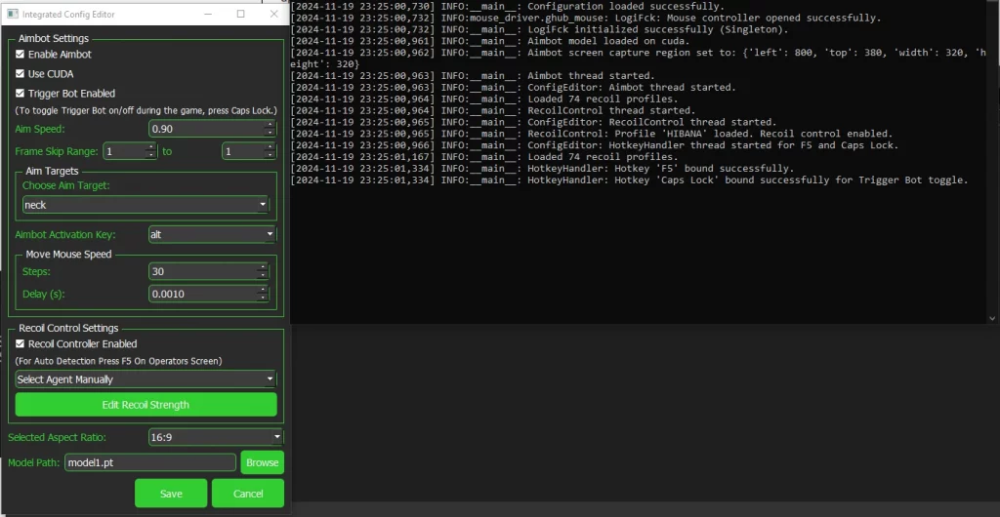

# GamerFun AI Menu

**GamerFun AI Menu** is an advanced tool that combines AI-powered aimbot, triggerbot, and recoil control—optimized for Rainbow Six Siege and many other top shooter games. By integrating state-of-the-art computer vision with Logitech driver support, GamerFun AI Menu provides precision targeting, smooth mouse movements, and customizable recoil profiles while mimicking human behavior to help avoid detection.

---
> **⚠️ Disclaimer:**  
> **This software is for educational and experimental purposes only. Use it only where you have explicit permission. Misuse may violate terms of service or laws. The author is not responsible for any consequences.**

---
## Table of Contents

- [Features](#features)
- [How It Works](#how-it-works)
- [Installation](#installation)
- [Usage](#usage)
- [Configuration](#configuration)
- [Performance & Requirements](#performance--requirements)
- [Troubleshooting](#troubleshooting)
- [License](#license)

---

>Latest Update V2:
>I’ve released the source code as I’m not planning to update this project any further for now. My focus has shifted to another, much more advanced > ## project using the TensorRT engine:

- **Official Website:** [AI Aimbot & Trigger Bot Cheat for Every Shooter Game](https://www.gamerfun.club/ai-aimbot-trigger-bot-cheat)
- **UnknownCheats Forum:** [AI Aimbot & Trigger Bot That Outperforms Internal and External Cheats](https://www.unknowncheats.me/forum/rainbow-six-siege/671029-gamerfun-ai-menu-mouse-aimbot-triggerbot-recoil-control-using-lgub-drivers.html)
- **GitHub Repository:** [TensorRT-AI-Aimbot-Triggerbot](https://github.com/WANASX/tensorrt-ai-aimbot-triggerbot)


## Features

- **AI Aimbot & Triggerbot**
  - Real-time enemy detection using a YOLO model.
  - Customizable settings including aim speed and target areas (head, neck, chest, legs).
  - Automatically fires when an enemy enters the crosshair (triggerbot).

- **Recoil Control**
  - Auto agent detection (triggered via F5) to automatically load the correct recoil profile.
  - Manual agent selection from the UI for precise recoil management.
  - Integrated with Logitech’s driver for safe and reliable recoil control.

- **User-Friendly Interface**
  - Easy-to-use UI built with PyQt5.
  - Real-time adjustments without editing configuration files.
  - Customizable activation keys:
    - **Left Alt:** Hold to activate Aimbot & Triggerbot.
    - **Caps Lock:** Toggle triggerbot active state.
    - **F5:** Trigger auto agent detection for recoil control.

- **Randomized Movements**
  - Incorporates slight random offsets in mouse movement and firing delays to mimic natural human behavior and reduce the risk of detection.

- **Optimized Performance**
  - Capable of running in the background with minimal impact on game performance.
  - Supports GPU acceleration with CUDA (recommended) for drastically reduced detection times.

---

---
## How It Works

1. **Detection:**  
   The tool continuously captures screen frames (using [mss](https://pypi.org/project/mss/)) and uses a YOLO (You Only Look Once) model (via [ultralytics](https://pypi.org/project/ultralytics/)) to detect enemy targets.

2. **Aiming:**  
   Once an enemy is detected, the program calculates the target coordinates (e.g., neck, head, etc.) and moves the mouse smoothly towards the target using Logitech driver integration.

3. **Shooting:**  
   If the enemy falls within the designated crosshair area and if triggerbot is enabled, the tool automatically simulates a mouse click to fire.

4. **Recoil Control:**  
   For weapons with significant recoil, the tool uses pre-defined recoil profiles—either auto-detected or manually selected—to counteract recoil during sustained fire.

5. **Mouse Driver Integration:** Uses the Logitech-CVE mouse driver (`ghub_mouse.dll`) from [ekknod on GitHub](https://github.com/ekknod/logitech-cve) for precise control.

---

## Installation

### Prerequisites

- **Operating System:** Windows (the tool uses Windows-specific libraries such as `win32api`)
- **Python 3.10+**
- **CUDA 12.4** [Download Here](https://developer.nvidia.com/cuda-12-4-0-download-archive) (Highly recommended for GPU acceleration; otherwise, detection runs on CPU and is slower)
- **Tesseract OCR**
  - Download and install from the [official GitHub repository](https://github.com/tesseract-ocr/tesseract)
  - Ensure `Tesseract.exe` is added to your system PATH

### Steps

1. **Clone the Repository:**

       git clone https://github.com/WANASX/ai-aimbot-triggerbot
       cd ai-aimbot-triggerbot

2. **Install Python Dependencies:**

   It is recommended to use a virtual environment.

       python -m venv venv
       venv\Scripts\activate
       pip install --upgrade pip
       pip install -r requirements.txt

3. **Setup Logitech G HUB:**

   - Download and install **Logitech G HUB** [version 2021-10-8013 From UC](https://www.unknowncheats.me/forum/downloads.php?do=file&id=39879) even if you do not own a Logitech mouse.
   - **Block Logitech G HUB from Internet Access:**  
     Use your firewall settings to block internet access to Logitech G HUB to prevent automatic updates.

4. **Additional Setup:**

   - Ensure that the required model file (`model1.pt`) and configuration files (`config.json`, `profiles.json`, and the Logitech DLL `ghub_mouse.dll`) are placed in the `libs` directory.
   - Run the provided installer batch file `Installer.bat` to complete any extra setup steps.

---

## Usage

1. **Launch the Application:**

       python Loader.py

2. **In-Game Activation:**

   - **Hold Left Alt:** Activates the Aimbot and Triggerbot functions.
   - **Press Caps Lock:** Toggle the triggerbot’s active state.
   - **Press F5:** Auto-detect your in-game agent for recoil control.

3. **Adjust Settings on the Fly:**

   Use the intuitive UI to adjust aim speed, select target areas, choose recoil profiles, and modify other settings without editing the configuration files manually.

---

## Configuration

The configuration file (`config.json`) located in the `libs` folder holds all adjustable parameters. This includes settings for:

- **Aimbot:** Enable/disable, aim speed, target choice (e.g., neck)
- **Triggerbot:** Activation key and trigger settings
- **Recoil Control:** Agent selection and recoil compensation values
- **Screen Regions:** Customizable coordinates for different aspect ratios

If the configuration file is not found, a default configuration will be automatically generated.

---

## Performance & Requirements

- **GPU Acceleration:**  
  For maximum scanning speed, install **CUDA 12.4**.
  - **With CUDA (GPU):** Approx. **5ms** detection times
  - **Without CUDA (CPU):** Approx. **30ms** detection times

- **System Impact:**  
  Optimized to run in the background with minimal performance impact on your game.

---

## Troubleshooting

- **Model Not Found:**  
  Ensure that `model1.pt` exists in the `libs` folder and that the configuration file points to the correct path.

- **Tesseract Issues:**  
  Confirm that Tesseract OCR is installed correctly and that its executable is included in your system PATH.

- **Driver Integration:**  
  If recoil control isn’t working, verify that Logitech G HUB is installed, the DLL (`ghub_mouse.dll`) is present in the `libs` folder, and that you have blocked G HUB from updating.

For further assistance, please check the issue tracker or open a new issue on GitHub.

---

## License

This project is provided "as is" without any warranty. Please review the [LICENSE](LICENSE) file for more details.

---

## Step-By-Step Video Guide

Watch our video guide for a detailed walkthrough on installation and usage:  
[](https://www.youtube.com/watch?v=RbwX7uay4_Q)

---


## Support & Donations

If you would like to support this project, you can donate **USDT Tron (TRC20)** to:
```
TDiVQzShforoR5XgWXfKuPhPhdgPypXAgB
```

For questions or support, contact **support@gamerfun.club**.
---
Enjoy gaming with precision and enhanced control using GamerFun AI Menu!
